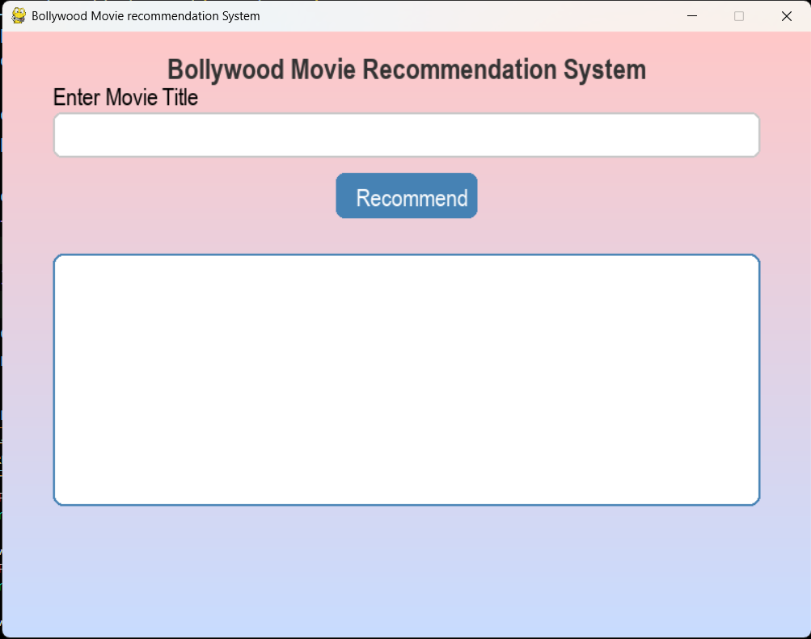
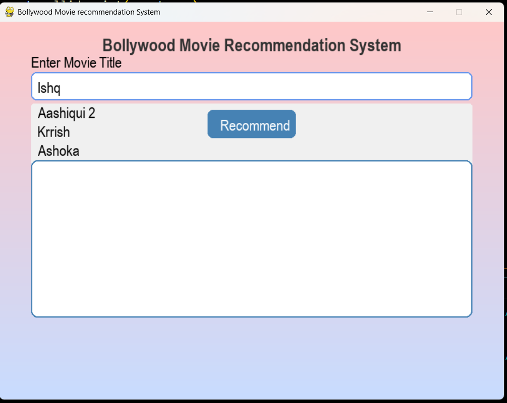
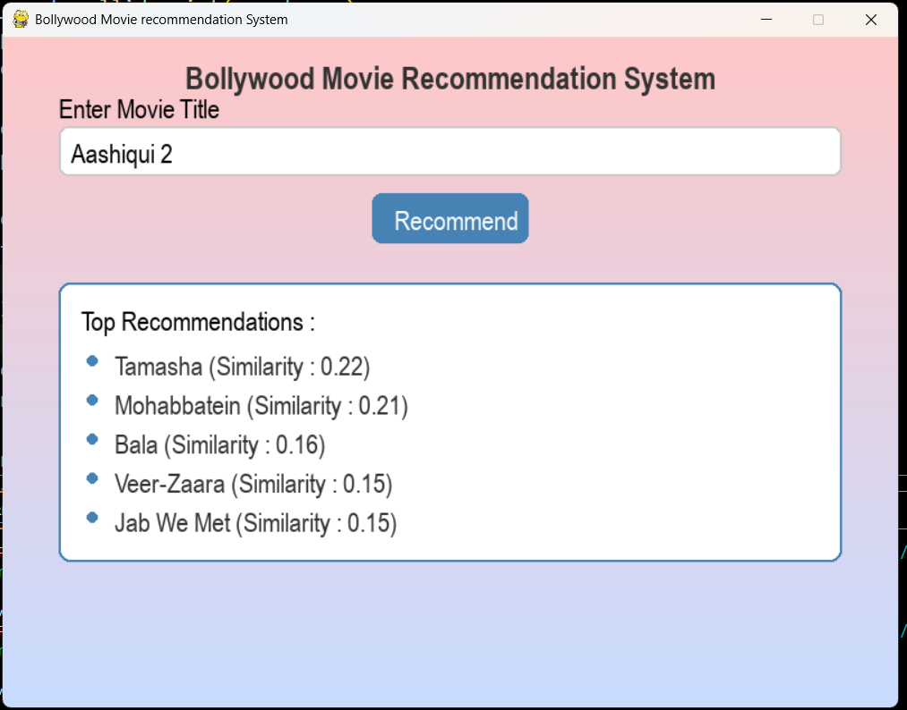

# 🎬 Bollywood Movie Recommendation System

A beautiful and interactive movie recommendation system built using **Python**, **Pygame**, and **Natural Language Processing (NLP)** techniques like **TF-IDF Vectorization** and **Cosine Similarity**. It provides **real-time recommendations** and **smart auto-suggestions** as the user types a movie name.

---

## 💡 Features

- 🎥 Recommends similar Bollywood movies based on description similarity.
- 🧠 Uses `TF-IDF` and `Cosine Similarity` to compute content-based similarity.
- 🔍 Real-time **auto-suggestions** using `difflib.get_close_matches()` as the user types.
- 🎨 Interactive GUI using `pygame` with styled input box, clickable buttons, and smooth UI.
- 🖱️ (Optional) Click on suggestions to autofill the movie title.

---

## 📸 Preview

> 
> 
> 

---

## 🛠️ Tech Stack

- Python 3.x
- Pygame (GUI)
- Scikit-learn (`TfidfVectorizer`, `cosine_similarity`)
- Difflib (built-in)

---

## 📦 Installation

1. **Clone the Repository**
   ```bash
   git clone https://github.com/NehaSindhwani01/Bollywood_Movie_Recommendation_System.git

2. **Create Virtual Environment (Optional but Recommended)**

    python -m venv env
   
    source env/bin/activate  # On Windows: env\Scripts\activate
   
    pip install -r requirements.txt
   
    ❗ difflib is part of Python’s standard library, so do not try to install it via pip.

4. **🚀Run the App**
    python recommend_system.py


🧠 How It Works
1. The TfidfVectorizer converts all movie descriptions into numeric vectors.
2. cosine_similarity compares the input movie vector with all others.
3. Top N recommendations (default 5) are shown based on similarity score.
4. As you type, difflib.get_close_matches() suggests matching movie titles.

📂 File Structure

├── movie_recommender.py       # Main Python file with Pygame GUI
├── requirements.txt           # Python dependencies
├── README.md                  # You're here!


🙋‍♀️ Created By
Neha Sindhwani
